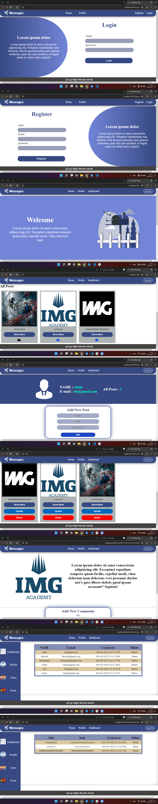

## FrontEnd
#1-Instoll project type next js
#2- Copy tow Files from Frontend to your project next
#3- Open terminal write npm i axios
#4- wrire in terminal npm run dev 

_____________________________________
## Backend 
#1- npm install
#2-  Open terminal write npm i bcryptjs
#3-  Open terminal write npm i cors
#4-  Open terminal write npm i dotenv
#5-  Open terminal write npm i express
#6-  Open terminal write npm i joi
#7-  Open terminal write npm i jsonwebtoken
#8-  Open terminal write npm i mongoose
#9-  Open terminal write npm i multer

#4- wrire in terminal npm start  

I use for images
 
<a href="https://storyset.com/people">People illustrations by Storyset</a> 
 
<a href="https://www.flaticon.com/free-icons/business-idea" title="business idea icons">Business idea icons created by Freepik - Flaticon</a>

